# AI-Powered Ticket Handling System

AI-Powered Ticket Handling System is a full-stack customer support platform for payment services teams. It combines a Next.js role-based frontend with a FastAPI backend, Supabase, Redis, Celery, LangGraph agents, RAG retrieval, SLA automation, realtime notifications, and manager analytics.

The project is designed as a portfolio-grade applied AI system: customers submit support tickets, the backend processes them through a multi-agent pipeline, the AI either drafts a grounded resolution or escalates with a human-ready brief, and managers can track ticket volume, SLA compliance, and operational health from dashboards.

## Technical Highlights

| Area | Implementation |
| --- | --- |
| Multi-agent orchestration | LangGraph pipeline with triage, router, resolver, escalation, and feedback nodes for end-to-end ticket processing. |
| AI triage | Classifies tickets, estimates urgency, assigns priority, calculates SLA deadlines, and prepares downstream routing context. |
| Conditional routing | Router agent decides whether a ticket can be auto-resolved through RAG or should be escalated to a human support agent. |
| RAG knowledge base | Knowledge articles and uploaded documents are parsed, chunked, embedded, stored in Supabase/Postgres, and searched with pgvector-backed retrieval. |
| Human-in-the-loop review | Agents can inspect AI drafts, review retrieved RAG evidence, approve responses, edit them, reject drafts, or reopen tickets. |
| Async processing | Redis and Celery separate request handling from background embedding generation and ticket processing work. |
| SLA engine | SLA policies, deadline calculation, warning notifications, breach detection, and manager SLA dashboards. |
| Natural-language analytics | Manager analytics endpoint translates business questions into safe analytics queries with validation and Redis caching. |
| Realtime UX | Supabase Realtime powers live ticket status updates and notification badges across customer, agent, and manager views. |
| Auth and authorization | Supabase Auth plus backend role checks for customer, agent, manager, and admin workflows. |
| Observability | LangSmith tracing, structured logging, ticket events, agent run records, retry metadata, and dead-letter handling. |
| Production-style services | Separate frontend, backend API, Celery worker, SLA checker, Redis, Supabase database, storage, and auth concerns. |
| API hardening | Redis-backed rate limiting, centralized error handling, request validation, and readonly analytics database access. |

## Architecture



The system is split into a Next.js frontend, FastAPI API layer, LangGraph agent processing layer, Supabase persistence layer, Redis queue/cache layer, Celery workers, and a standalone SLA checker. This separation keeps customer-facing requests responsive while AI and document-processing work runs asynchronously.

## Agent Pipeline



The ticket pipeline follows a clear operational flow:

1. A customer submits a payment-services support issue.
2. The FastAPI backend validates the request, authenticates the user, stores attachments, persists the ticket, and enqueues processing.
3. The triage agent classifies the issue, estimates urgency, detects duplicate signals, and calculates an SLA deadline.
4. The router agent chooses between auto-resolution and escalation.
5. The resolver agent searches the knowledge base, gathers RAG evidence, and drafts a resolution when confidence is high enough.
6. The escalation agent writes a human-readable brief, assigns the ticket to the right team, and triggers notifications when human review is needed.
7. The feedback node records outcomes so future analytics and knowledge workflows can improve.
8. Customers, agents, and managers see status changes through realtime UI updates.

## Frontend

The frontend is a Next.js App Router application in `frontend/`.

Key frontend capabilities:

| Area | Details |
| --- | --- |
| Customer portal | Ticket creation, ticket list, ticket detail pages, status tracking, and feedback submission. |
| Agent workspace | Agent dashboard, SLA-sorted ticket queue, ticket detail workflow, AI draft review, and retrieved RAG evidence display. |
| Knowledge base UI | Article list, article editor, document upload flow, and knowledge creation screens. |
| Manager console | Overview dashboard, team view, SLA dashboard, analytics page, and reporting views. |
| Realtime state | Supabase subscriptions for ticket updates and notification changes. |
| Data fetching | TanStack Query hooks for analytics, notifications, and ticket-related workflows. |
| UI stack | React, TypeScript, Tailwind CSS, Recharts, TipTap editor, and Lucide icons. |

## Backend

The backend is a FastAPI application in `backend/`.

Core backend responsibilities:

| Area | Details |
| --- | --- |
| API routing | Versioned routes under `/api/v1` for health, tickets, knowledge, notifications, manager views, analytics, and SLA. |
| Ticket lifecycle | Ticket creation, queueing, claiming, AI draft approval/rejection, edit-and-resolve, reopen, and feedback flows. |
| Authentication | Supabase JWT verification and role-based dependencies for protected manager and agent endpoints. |
| Background work | Celery tasks for embeddings and worker processes for ticket handling. |
| Redis usage | Queueing, rate limiting, analytics caching, retry metadata, and dead-letter queue support. |
| Supabase usage | PostgreSQL data, pgvector search, Auth, Storage for attachments, Realtime, RLS policies, and migrations. |
| Resilience | LLM circuit breaker, retry/dead-letter handling, centralized API error responses, and structured logs. |

## Agent System

The AI layer is implemented with LangGraph and Google Gemini models through LangChain integrations.

Pipeline nodes:

| Node | Purpose |
| --- | --- |
| Triage | Classifies the ticket, determines priority, computes SLA context, and updates ticket metadata. |
| Router | Decides whether the system should attempt RAG resolution or escalate to a human team. |
| Resolver | Searches the knowledge base and drafts an AI response using retrieved evidence. |
| Escalation | Produces a support brief, calculates SLA details, assigns ownership, and sends notifications. |
| Feedback | Records the outcome of the agent run and closes the graph path. |
| Analytics | Runs separately from the ticket pipeline to support manager natural-language analytics. |

## Knowledge Base and RAG

The knowledge system supports both manually authored articles and document uploads.

Important implementation details:

| Capability | Implementation |
| --- | --- |
| Article management | CRUD endpoints and frontend screens for creating, editing, listing, and deleting knowledge articles. |
| Document ingestion | Uploaded files are parsed through backend document services before being converted into article content. |
| Chunking | Content is split into structured chunks with chunk indexes and section metadata. |
| Embeddings | Celery queues embedding generation so ingestion does not block API requests. |
| Retrieval | RAG search uses stored knowledge chunks and vector similarity to return relevant evidence for resolver drafts. |
| Reviewability | Agent ticket detail screens expose retrieved RAG evidence so humans can inspect what grounded a draft. |

## Analytics and SLA

Managers get operational visibility through dashboards and natural-language analytics.

| Area | Details |
| --- | --- |
| KPI dashboard | Ticket totals, auto-resolution rate, average resolution time, CSAT, and SLA compliance metrics. |
| Trend charts | Recharts-powered visualizations for volume trends, category breakdowns, and SLA compliance. |
| Natural-language query | Manager asks a business question, backend generates a controlled SQL query, validates it, executes it through readonly access, and caches results. |
| SLA policies | Create, update, delete, and list priority-based SLA policies. |
| Breach detection | SLA checker scans active tickets, emits warnings, marks breaches, and creates notifications. |
| Backfill support | Scripted SLA deadline backfill for older ticket records. |

## Observability

The project includes several production-minded observability hooks:

| Signal | Purpose |
| --- | --- |
| LangSmith traces | Inspect agent calls, prompts, responses, and execution behavior when tracing is enabled. |
| Structured logs | Backend services and workers emit structured log events for processing and failure paths. |
| Ticket events | Ticket lifecycle actions are persisted for auditability. |
| Agent run records | Agent execution metadata can be inspected separately from the ticket row. |
| Processing metadata | Tickets track attempts, processing errors, and last error timestamps. |
| Dead-letter queue | Failed ticket processing can be inspected through the Redis `tickets:dead_letter` list. |

## API Surface

Primary backend endpoints are exposed under `/api/v1`.

| Area | Endpoints |
| --- | --- |
| Health | `GET /health` |
| Tickets | `POST /tickets`, `GET /tickets`, `GET /tickets/queue`, `POST /tickets/{id}/claim`, `POST /tickets/{id}/approve`, `POST /tickets/{id}/reject`, `POST /tickets/{id}/edit-resolve`, `POST /tickets/{id}/reopen`, `POST /tickets/{id}/feedback` |
| Knowledge | `POST /knowledge`, `GET /knowledge`, `GET /knowledge/{id}`, `PUT /knowledge/{id}`, `DELETE /knowledge/{id}`, `POST /knowledge/upload` |
| Notifications | `GET /notifications`, `PATCH /notifications/{id}/read` |
| Manager | `GET /manager/overview`, `GET /manager/teams` |
| Analytics | `GET /analytics/dashboard`, `POST /analytics/query` |
| SLA | `GET /sla/dashboard`, `GET /sla/policies`, `POST /sla/policies`, `PUT /sla/policies/{id}`, `DELETE /sla/policies/{id}` |

See [docs/api-reference.md](docs/api-reference.md) for the compact API reference.

## Deployment Shape

The repository is structured for a split full-stack deployment:

```text
Next.js frontend
  -> Hosted as a web application
  -> Connects to backend through NEXT_PUBLIC_API_URL

FastAPI backend
  -> Containerized with backend/Dockerfile
  -> Exposes the /api/v1 HTTP API

Celery worker
  -> Uses the same backend image
  -> Processes async embedding and background work

SLA checker
  -> Uses the same backend image
  -> Periodically scans tickets for SLA warnings and breaches

Managed services
  -> Supabase for Postgres, pgvector, Auth, Storage, and Realtime
  -> Redis for queues, rate limits, caching, and dead-letter records
  -> Gemini for LLM calls
  -> LangSmith for optional traceability
```

See [docs/deployment-guide.md](docs/deployment-guide.md) for deployment requirements and ordering.

## Local Setup

### 1. Clone and create environment files

```powershell
Copy-Item .env.example .env
```

Fill in local values only. Do not commit real API keys, database URLs, Supabase service keys, or LangSmith keys.

### 2. Start backend services

From the repository root:

```powershell
docker compose up --build
```

This starts:

| Service | Purpose | URL |
| --- | --- | --- |
| `backend` | FastAPI API server | `http://localhost:8000` |
| `worker` | Celery background worker | n/a |
| `sla-checker` | SLA warning and breach scanner | n/a |
| `redis` | Queue, cache, and rate-limit store | `localhost:6379` |

### 3. Start the frontend

```powershell
cd frontend
npm install
npm run dev
```

The frontend runs at:

```text
http://localhost:3000
```

## Environment Variables

### Backend required

| Variable | Purpose |
| --- | --- |
| `SUPABASE_URL` | Supabase project URL. |
| `SUPABASE_ANON_KEY` | Public Supabase anon key for authenticated API operations. |
| `SUPABASE_SERVICE_KEY` | Server-side Supabase service key for privileged backend operations. |
| `READONLY_DATABASE_URL` | Readonly Postgres connection used by analytics queries. |
| `REDIS_URL` | Redis connection string for queues, caching, and rate limiting. |
| `GEMINI_API_KEY` | Gemini API key for LLM-powered agents and analytics. |
| `FRONTEND_ORIGIN` | Allowed frontend origin for CORS. |

### Backend optional

| Variable | Default | Purpose |
| --- | --- | --- |
| `ENVIRONMENT` | `development` | Runtime environment. |
| `CELERY_BROKER_URL` | `redis://redis:6379` | Celery broker URL. |
| `ANALYTICS_CACHE_TTL_SECONDS` | `300` | Redis cache TTL for analytics responses. |
| `SLA_CHECK_INTERVAL_SECONDS` | `60` | SLA checker polling interval. |
| `RATE_LIMIT_REQUESTS_PER_MINUTE` | `100` | General API request rate limit. |
| `RATE_LIMIT_TICKET_SUBMISSIONS_PER_HOUR` | `10` | Ticket submission limit per identity. |
| `LLM_CIRCUIT_BREAKER_FAILURE_THRESHOLD` | `3` | Failures before opening the LLM circuit breaker. |
| `LLM_CIRCUIT_BREAKER_RECOVERY_SECONDS` | `60` | Recovery window before retrying LLM calls. |
| `LANGCHAIN_TRACING_V2` | `false` | Enables LangSmith tracing when set. |
| `LANGCHAIN_ENDPOINT` | `https://api.smith.langchain.com` | LangSmith API endpoint. |
| `LANGCHAIN_API_KEY` | empty | LangSmith API key. |
| `LANGCHAIN_PROJECT` | `tickets-project` | LangSmith project name. |

### Frontend required

| Variable | Purpose |
| --- | --- |
| `NEXT_PUBLIC_SUPABASE_URL` | Supabase project URL used by the browser app. |
| `NEXT_PUBLIC_SUPABASE_ANON_KEY` | Public Supabase anon key. |
| `NEXT_PUBLIC_SUPABASE_PUBLISHABLE_KEY` | Supabase publishable key when used by the frontend client. |
| `NEXT_PUBLIC_API_URL` | Backend API URL, usually `http://localhost:8000`. |

## Testing and Manual Checks

Useful verification steps:

```powershell
cd frontend
npm run lint
```

Manual end-to-end checks:

| Check | Expected result |
| --- | --- |
| Register or log in as a customer | User is routed to the customer ticket portal. |
| Submit a ticket | Ticket is created, persisted, and queued for background processing. |
| Watch ticket detail page | Status updates appear through Supabase Realtime. |
| Review as agent | Escalated tickets appear in the agent queue sorted by SLA urgency. |
| Inspect AI draft | Agent can see draft text and retrieved RAG evidence. |
| Approve, edit, or reject draft | Ticket lifecycle updates and notifications are created. |
| Open manager overview | KPI cards and charts load from analytics and SLA endpoints. |
| Ask analytics question | Backend returns a validated analytics result or a controlled validation error. |
| Trigger SLA warning path | SLA checker marks warnings or breaches and creates notifications. |

Operational troubleshooting is documented in [docs/runbook.md](docs/runbook.md).

## Documentation

| Document | Purpose |
| --- | --- |
| [docs/system_overview.md](docs/system_overview.md) | Full ticket journey from submission to resolution and observability. |
| [docs/architecture.md](docs/architecture.md) | Detailed architecture plan and subsystem design. |
| [docs/phases.md](docs/phases.md) | Implementation phases and feature buildout. |
| [docs/api-reference.md](docs/api-reference.md) | Compact backend endpoint reference. |
| [docs/deployment-guide.md](docs/deployment-guide.md) | Deployment requirements and order. |
| [docs/runbook.md](docs/runbook.md) | Common incidents and troubleshooting steps. |

## Security Notes

Never commit real environment values. Rotate any API key, Supabase service key, database password, or LangSmith key that was ever committed, pasted, or shared.

Before publishing this repository publicly on GitHub, review `.env.example` and replace any real-looking values with placeholders such as:

```text
SUPABASE_URL=your-supabase-url
SUPABASE_ANON_KEY=your-supabase-anon-key
SUPABASE_SERVICE_KEY=your-supabase-service-key
READONLY_DATABASE_URL=your-readonly-postgres-url
GEMINI_API_KEY=your-gemini-api-key
LANGCHAIN_API_KEY=your-langsmith-api-key
```

Keep `.env`, production secrets, service-role keys, local database URLs, and generated private artifacts out of git.
